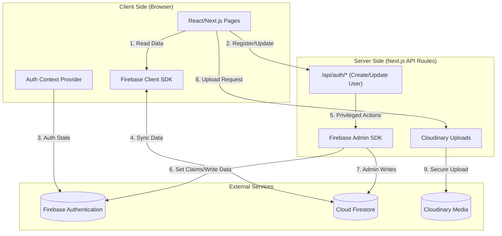

# DMU Property Management System — Client vs. Server Architecture

This document details the separation of concerns between the Client-Side (Browser) and Server-Side (Next.js/Node.js) in the application.

## High-Level Architecture

---

## Detailed Breakdown

### 1. Client-Side (Frontend)
**Technologies:** React, Tailwind CSS, Firebase Client SDK (`v9`), Framer Motion.

*   **Responsibilities:**
    *   **User Interface:** Rendering forms (Form 20), dashboards, and tables.
    *   **Authentication State:** `AuthContext` listens to Firebase `onAuthStateChanged`.
    *   **Data Fetching (Read):** Directly queries Firestore using `onSnapshot` for real-time updates (e.g., `Request_materials`, `materials`).
    *   **Direct Writes:** Users write to collections they own (e.g., creating a `Request_materials` doc) secured by Firestore Security Rules.
    *   **Video Conferencing:** Runs Jitsi Meet directly in the browser.

### 2. Server-Side (Backend)
**Technologies:** Next.js API Routes, Firebase Admin SDK, Cloudinary SDK.

*   **Responsibilities:**
    *   **User Management (Privileged):**
        *   Example: `RegisterUser.tsx` calls `/api/auth/create-user`.
        *   **Why?** Creating users with specific *Custom Claims* (admin, roles) cannot be done securely on the client. The Admin SDK allows this.
        *   **Routes:**
            *   `/api/auth/create-user`: Creates auth user & Firestore profile.
            *   `/api/auth/update-user`: Updates sensitive fields.
            *   `/api/auth/verify-token`: Verifies session cookies (if used).
    *   **Image Management:**
        *   **Why?** To keep Cloudinary API Secrets hidden.
        *   The client sends the file -> Server signs the request -> Uploads to Cloudinary.
    *   **Complex Logic:** Generating unique IDs or batch operations that require transactional integrity (optional, but good practice).

---

## Data Flow Examples

### Scenario A: User Login (Client-Side)
1.  **Client:** User enters email/password.
2.  **Client:** `signInWithEmailAndPassword` (Firebase Client SDK) is called.
3.  **Firebase Auth:** Verifies credentials and returns a token.
4.  **Client:** `AuthContext` updates state, user is redirected to dashboard.

### Scenario B: Registering a New Employee (Server-Side Hybrid)
1.  **Client:** Admin fills out registration form.
2.  **Client:** Sends POST request to `/api/auth/create-user` with details.
3.  **Server:** Authenticates the request (ensures requester is Admin).
4.  **Server:** Initializes **Firebase Admin SDK**.
5.  **Server:** Calls `admin.auth().createUser()` with custom claims (role, department).
6.  **Server:** Creates user document in `users` collection.
7.  **Server:** Returns success to Client.

### Scenario C: Approving a Material Request (Client-Side)
1.  **Client:** Department Head clicks "Approve".
2.  **Client:** Checks `AuthContext` for `department_head` role.
3.  **Client:** Calls `updateDoc()` on the specific `Request_materials` document.
4.  **Firestore Rules:** Verify `request.auth.token.role == 'department_head'` before allowing the write.
